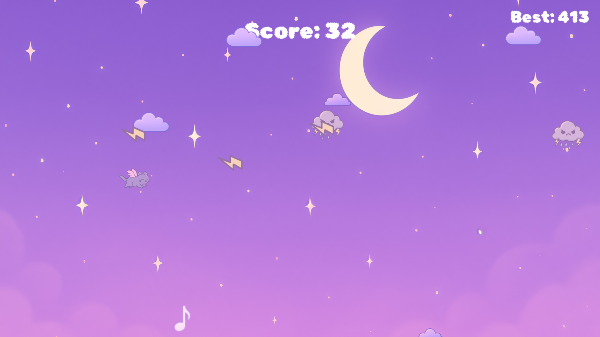

# Endless Runner Prototype

A 2D arcade game prototype developed in Godot.

## About

This project recreates the core gameplay of Flappy Bird while demonstrating gameplay programming and game mechanics implementation.

## Screenshot

## Gameplay

## Features

- Random obstacle generation
- Global Score system
- Local save game
- Simple UI

## Built With

- Godot 4
- GDScript

## My Contribution

- Gameplay programming
- UI implementation
- Player controller
- Obstacle spawning
- Score system
- Assets